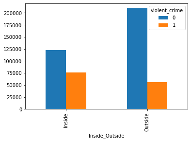
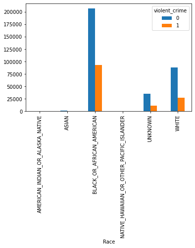
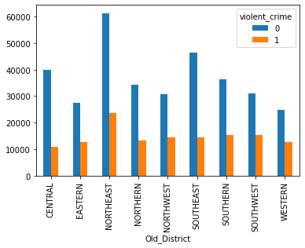
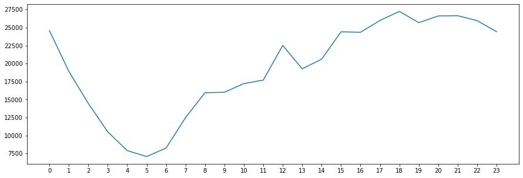
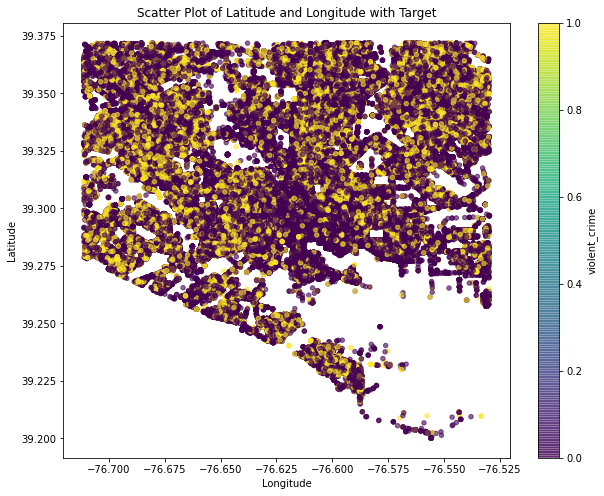
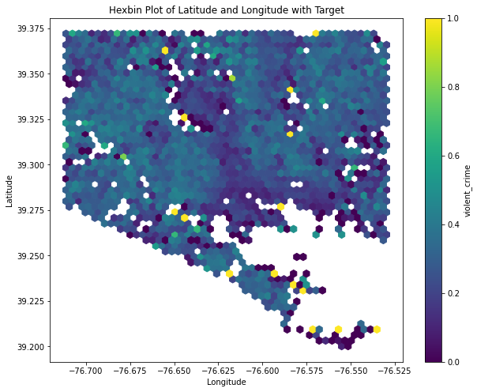
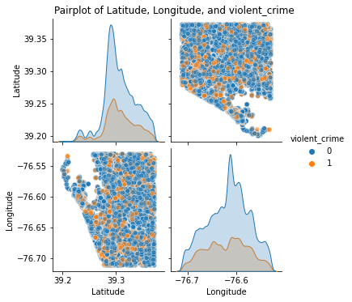

# Predictive Analysis of Violent Crimes in Baltimore

## Project Description
This project conducts a detailed predictive analysis of violent crimes in Baltimore using various machine learning models. The aim is to provide predictive insights to law enforcement for more effective crime prevention strategies. This repository contains the data, Python scripts, and Jupyter notebooks used to perform the analysis.

## Key Insights

### Crime Incidence by Location: Inside vs Outside

*Analysis shows a higher incidence of violent crimes occurring outside, which could influence deployment strategies of law enforcement resources.*

### Crime Distribution by Race

*This visualization indicates the racial distribution of crime victims and highlights areas where community and police engagement could be targeted.*

### Crime Trends Over Time by Region

*Different Regions show varying levels of crime incidents, suggesting a need for district-specific crime prevention strategies.*

### Hourly Crime Trends

*Crime rates peak at specific hours, which could help in optimizing patrol times.*

### Scatter and Hexbin Plots of Crime Locations

*These plots provide a granular look at where crimes are most concentrated, aiding in visualizing hotspots within the city.*

### Pairplot of Geographic and Crime Data

*Exploring relationships between geographic coordinates and crime occurrences to uncover patterns.*

## Models Evaluated
The following machine learning models were evaluated in this study to predict violent crime occurrences:
- Xgboost
- Random Forest Classifier
- Gradient Boosting
- AdaBoost
- Logistic Regression
- KNN (K-Nearest Neighbors)
- Decision Tree

## Dataset
The dataset used in this project consists of over 100,000 crime records from Baltimore City, focusing on attributes relevant to crime occurrences and temporal patterns.

## Methodology
- **Data Preprocessing**: Data cleaning, feature selection, and data transformation to prepare the dataset for modeling.
- **Model Training**: Each model was trained using the processed dataset. Hyperparameters were tuned for optimal results.
- **Performance Evaluation**: Models were evaluated based on Accuracy, Precision, Recall, F1 Score, and ROC AUC Score.

## Results
The performance of the models is summarized as follows:

| Model Name               | Accuracy Score | Precision Score | Recall Score | F1 Score | ROC AUC Score |
|--------------------------|----------------|-----------------|--------------|----------|---------------|
| **Xgboost**              | 0.758452       | 0.545099        | 0.211849     | 0.305117 | 0.576408      |
| **Random Forest**        | 0.754492       | 0.522518        | 0.223143     | 0.312732 | 0.577528      |
| **Gradient Boosting**    | 0.753243       | 0.526541        | 0.141309     | 0.222820 | 0.549441      |
| **AdaBoost**             | 0.748615       | 0.468855        | 0.031931     | 0.059790 | 0.509926      |
| **Logistic Regression**  | 0.744059       | 0.439009        | 0.080773     | 0.136442 | 0.523154      |
| **KNN**                  | 0.713185       | 0.402694        | 0.301651     | 0.344925 | 0.576125      |
| **Decision Tree**        | 0.663591       | 0.345315        | 0.383857     | 0.363567 | 0.570427      |

## Conclusion
The Xgboost model achieved the highest accuracy and a balanced ROC AUC score, making it the most effective among the tested models for predicting violent crime occurrences in Baltimore. This analysis aids in providing law enforcement with a more robust tool to forecast and potentially prevent future crimes.

## Technologies
- Python
- Pandas
- Scikit-Learn
- Matplotlib

## How to Run
Instructions for setting up, processing data, training models, and evaluating results are provided in the notebooks within this repository.
